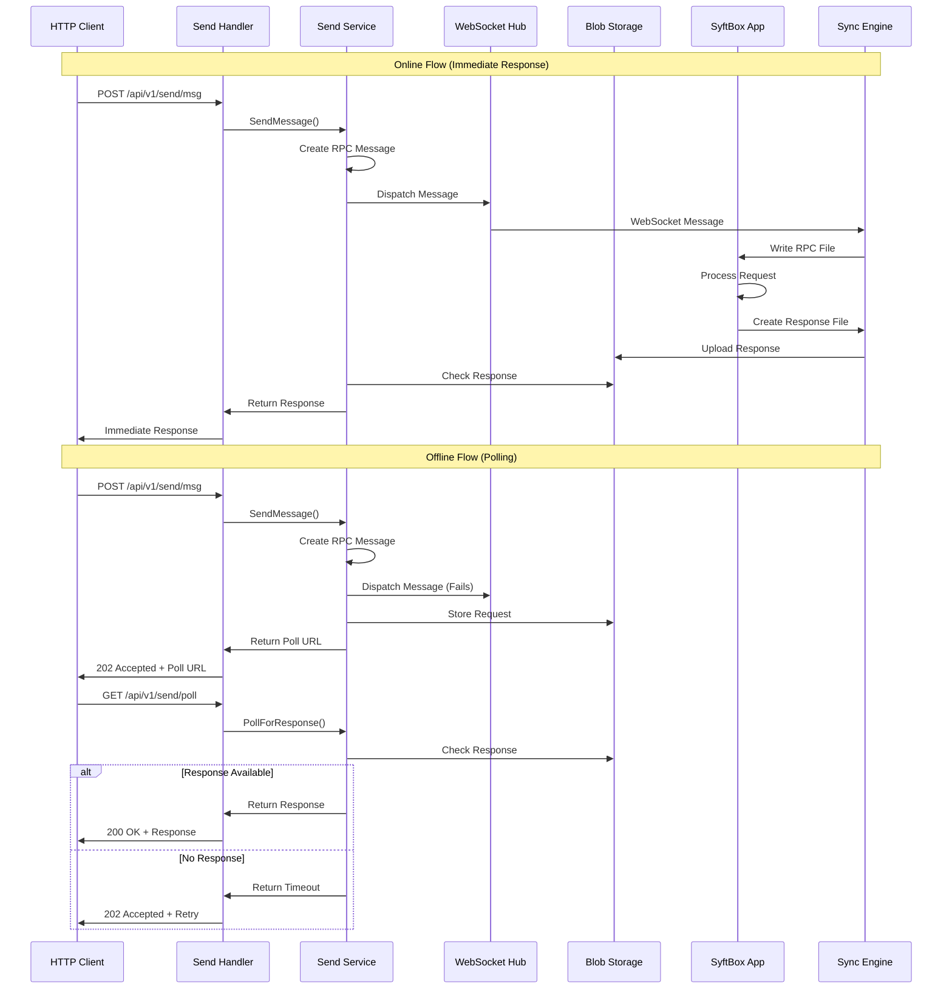
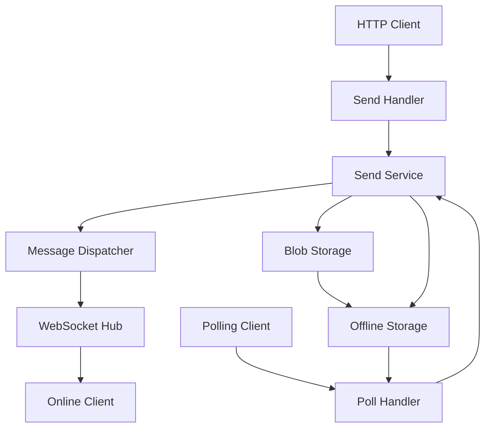

# Send Handler and Service Documentation

## 1. Overview

### At a Glance
The Send Handler and Service components provide an HTTP-to-RPC bridge that enables asynchronous communication between clients and SyftBox applications. The system supports both online (WebSocket) and offline (polling) message delivery mechanisms.

### System Interaction Overview



### Purpose
- **HTTP-to-RPC Bridge**: Converts HTTP requests into RPC messages that can be delivered to SyftBox applications
- **Asynchronous Communication**: Supports both immediate responses (online) and delayed responses (offline polling)
- **Message Persistence**: Stores RPC messages in blob storage for reliable delivery
- **WebSocket Integration**: Provides real-time message delivery when clients are online

### Key Benefits
- **Offline Support**: Messages are stored and can be retrieved when clients come online
- **Reliable Delivery**: Uses blob storage for message persistence
- **Flexible Response Handling**: Supports both immediate and polling-based response retrieval
- **Cross-Platform**: Works with any HTTP client

### Scope
**Implemented Features:**
- HTTP request to RPC message conversion
- WebSocket message dispatch
- Blob storage for message persistence
- Polling-based response retrieval
- HTML and JSON response formats
- Request/response cleanup

**Not Implemented:**
- TODO: ACL permission checking for message sending
- TODO: Header filtering for security
- Large file uploads/downloads via blob APIs

## 2. Architecture

### System Design



### Core Components

#### Send Handler (`send_handler.go`)
- **Purpose**: HTTP request handling and response formatting
- **Key Methods**:
  - `SendMsg()`: Processes incoming HTTP requests
  - `PollForResponse()`: Handles polling requests for responses
  - `readRequestBody()`: Validates and reads request bodies

#### Send Service (`send_service.go`)
- **Purpose**: Business logic for message processing and delivery
- **Key Methods**:
  - `SendMessage()`: Creates RPC messages and handles delivery
  - `PollForResponse()`: Retrieves stored responses
  - `checkForResponse()`: Handles online response processing
  - `pollForObject()`: Polls blob storage for objects

#### Message Store (`msg_store.go`)
- **Purpose**: Blob storage interface for RPC messages
- **Implementation**: `BlobMsgStore` using the blob service
- **Operations**: Store, retrieve, and delete messages

#### WebSocket Dispatcher (`ws_dispatch.go`)
- **Purpose**: Real-time message delivery via WebSocket
- **Implementation**: `WSMsgDispatcher` using the WebSocket hub

### Data Flow

#### Message Send Flow
1. **HTTP Request**: Client sends HTTP request to `/api/v1/send/msg`
2. **Request Processing**: Handler validates and extracts request data
3. **RPC Creation**: Service creates `SyftRPCMessage` from HTTP request
4. **Message Dispatch**: Attempts WebSocket delivery to online clients
5. **Storage**: Stores RPC message in blob storage
6. **Response**: Returns immediate response or poll URL

#### Response Retrieval Flow
1. **Poll Request**: Client polls `/api/v1/send/poll` for response
2. **Storage Check**: Service checks blob storage for response file
3. **Response Processing**: Retrieves and formats response data
4. **Cleanup**: Removes request/response files from storage

## 3. Technical Deep Dive

### Data Structures

#### MessageRequest
```go
type MessageRequest struct {
    SyftURL utils.SyftBoxURL `form:"x-syft-url" binding:"required"`
    From    string           `form:"x-syft-from" binding:"required"`
    Timeout int              `form:"timeout" binding:"gte=0"`
    AsRaw   bool             `form:"x-syft-raw" default:"false"`
    Method  string           // Set from request method
    Headers Headers          // Set from request headers
}
```

#### PollObjectRequest
```go
type PollObjectRequest struct {
    RequestID string           `form:"x-syft-request-id" binding:"required"`
    From      string           `form:"x-syft-from" binding:"required"`
    SyftURL   utils.SyftBoxURL `form:"x-syft-url" binding:"required"`
    Timeout   int              `form:"timeout,omitempty" binding:"gte=0"`
    UserAgent string           `form:"user-agent,omitempty"`
    AsRaw     bool             `form:"x-syft-raw" default:"false"`
}
```

#### HttpMsg
```go
type HttpMsg struct {
    From    string            `json:"from"`
    SyftURL utils.SyftBoxURL  `json:"syft_url"`
    Method  string            `json:"method"`
    Headers map[string]string `json:"headers,omitempty"`
    Body    []byte            `json:"body,omitempty"`
    Id      string            `json:"id"`
    Etag    string            `json:"etag,omitempty"`
}
```

### Configuration

#### Send Service Config
```go
type Config struct {
    DefaultTimeout      time.Duration // Default: 1 second
    MaxTimeout          time.Duration // Default: 10 seconds
    ObjectPollInterval  time.Duration // Default: 200ms
    RequestCheckTimeout time.Duration // Default: 200ms
    MaxBodySize         int64         // Default: 4MB
}
```

**Note**: The default 4MB limit is designed for control messages and small payloads.

### API Reference

#### Send Message Endpoint
- **URL**: `/api/v1/send/msg`
- **Method**: Any HTTP method
- **Authentication**: JWT required (guest access allowed)

**Query Parameters:**
- `x-syft-url` (required): SyftBox URL for the target application
- `x-syft-from` (required): Sender datasite (email address)
- `timeout` (optional): Request timeout in milliseconds
- `x-syft-raw` (optional): Return raw response format

**Headers:** All request headers are forwarded to the RPC message

**Request Body:** Any content (up to 4MB by default)

**Note:** For large file uploads/downloads, use the blob API directly instead of HTTP-over-RPC.

**Authentication:** 
- JWT Bearer token required for authenticated users
- Use `guest@syft.org` as `x-syft-from` for guest access (no Bearer token needed)

**Response:**
```json
{
    "request_id": "uuid-string",
    "data": {
        "poll_url": "/api/v1/send/poll?x-syft-request-id=..."
    },
    "message": "Request has been accepted. Please check back later."
}
```

#### Poll Response Endpoint
- **URL**: `/api/v1/send/poll`
- **Method**: GET
- **Authentication**: JWT required (guest access allowed)

**Query Parameters:**
- `x-syft-request-id` (required): Request ID from send operation
- `x-syft-from` (required): Original sender datasite (email address)
- `x-syft-url` (required): Original SyftBox URL
- `timeout` (optional): Poll timeout in milliseconds
- `x-syft-raw` (optional): Return raw response format

**Response (Success):**
```json
{
    "request_id": "uuid-string",
    "data": {
        "message": {
            "id": "uuid",
            "sender": "sender-id",
            "url": "syft://...",
            "method": "POST",
            "status_code": 200,
            "body": "base64-encoded-response",
            "headers": {},
            "created": "2024-01-01T00:00:00Z",
            "expires": "2024-01-02T00:00:00Z"
        }
    }
}
```

**Response (Timeout):**
```json
{
    "error": "timeout",
    "message": "Polling timeout reached. The request may still be processing.",
    "request_id": "uuid-string"
}
```

## 4. Practical Examples

### Use Case Scenarios

#### Use Case 1: Database Query Service (Authenticated User)

**Scenario**: A client wants to query a database through a SyftBox application that processes SQL queries and returns results.

**Request:**
```bash
curl -X POST "https://syftbox.net/api/v1/send/msg?x-syft-url=syft://alice@company.com/app_data/db-service/rpc/query&x-syft-from=alice@company.com&timeout=5000" \
  -H "Content-Type: application/json" \
  -H "Authorization: Bearer <jwt-token>" \
  -H "X-Request-ID: req-12345" \
  -d '{
    "sql": "SELECT * FROM users WHERE status = ?",
    "params": ["active"],
    "limit": 100
  }'
```

**Response (Online - Immediate):**
```json
{
    "request_id": "a1b2c3d4-e5f6-7890-abcd-ef1234567890",
    "data": {
        "message": {
            "id": "a1b2c3d4-e5f6-7890-abcd-ef1234567890",
            "sender": "web-client",
            "url": "syft://alice@company.com/app_data/db-service/rpc/query",
            "method": "POST",
            "status_code": 200,
            "body": "eyJyZXN1bHRzIjpbeyJpZCI6MSwibmFtZSI6IkpvaG4gRG9lIiwic3RhdHVzIjoiYWN0aXZlIn0seyJpZCI6MiwibmFtZSI6IkphbmUgU21pdGgiLCJzdGF0dXMiOiJhY3RpdmUifV0sInRvdGFsIjoxMDB9",
            "headers": {
                "Content-Type": "application/json",
                "X-Request-ID": "req-12345"
            },
            "created": "2024-01-15T10:30:00Z",
            "expires": "2024-01-16T10:30:00Z"
        }
    }
}
```

#### Use Case 2: Machine Learning Model Inference (Authenticated User)

**Scenario**: A client sends data to a machine learning model for prediction.

**Request:**
```bash
curl -X POST "https://syftbox.net/api/v1/send/msg?x-syft-url=syft://ml-team@research.com/app_data/sentiment-analysis/rpc/predict&x-syft-from=ml-team@research.com" \
  -H "Content-Type: application/json" \
  -H "Authorization: Bearer <jwt-token>" \
  -d '{
    "text": "I love this product! It works perfectly.",
    "model_version": "v2.1",
    "confidence_threshold": 0.8
  }'
```

**Response (Offline - Poll Required):**
```json
{
    "request_id": "b2c3d4e5-f6g7-8901-bcde-f23456789012",
    "data": {
        "poll_url": "/api/v1/send/poll?x-syft-request-id=b2c3d4e5-f6g7-8901-bcde-f23456789012&x-syft-url=syft://ml-team@research.com/app_data/sentiment-analysis/rpc/predict&x-syft-from=ml-team@research.com&x-syft-raw=false"
    },
    "message": "Request has been accepted. Please check back later."
}
```

**Poll Request:**
```bash
curl "https://syftbox.net/api/v1/send/poll?x-syft-request-id=b2c3d4e5-f6g7-8901-bcde-f23456789012&x-syft-url=syft://ml-team@research.com/app_data/sentiment-analysis/rpc/predict&x-syft-from=ml-team@research.com&timeout=10000" \
  -H "Authorization: Bearer <jwt-token>"
```

**Poll Response:**
```json
{
    "request_id": "b2c3d4e5-f6g7-8901-bcde-f23456789012",
    "data": {
        "message": {
            "id": "b2c3d4e5-f6g7-8901-bcde-f23456789012",
            "sender": "ml-team@research.com",
            "url": "syft://ml-team@research.com/app_data/sentiment-analysis/rpc/predict",
            "method": "POST",
            "status_code": 200,
            "body": "eyJwcmVkaWN0aW9uIjoicG9zaXRpdmUiLCJjb25maWRlbmNlIjowLjk1LCJtb2RlbF92ZXJzaW9uIjoidjIuMSIsInByb2Nlc3NpbmdfdGltZSI6MS4yfQ==",
            "headers": {
                "Content-Type": "application/json",
                "X-Model-Version": "v2.1"
            },
            "created": "2024-01-15T10:35:00Z",
            "expires": "2024-01-16T10:35:00Z"
        }
    }
}
```

#### Use Case 2b: Guest Access - Public API Demo

**Scenario**: A guest user wants to try a public sentiment analysis API without authentication.

**Request:**
```bash
curl -X POST "https://syftbox.net/api/v1/send/msg?x-syft-url=syft://demo@syftbox.net/app_data/public-sentiment/rpc/analyze&x-syft-from=guest@syft.org" \
  -H "Content-Type: application/json" \
  -d '{
    "text": "This is amazing!",
    "language": "en"
  }'
```

**Response (Immediate):**
```json
{
    "request_id": "f6g7h8i9-j0k1-2345-fghi-678901234567",
    "data": {
        "message": {
            "id": "f6g7h8i9-j0k1-2345-fghi-678901234567",
            "sender": "guest@syft.org",
            "url": "syft://demo@syftbox.net/app_data/public-sentiment/rpc/analyze",
            "method": "POST",
            "status_code": 200,
            "body": "eyJzZW50aW1lbnQiOiJwb3NpdGl2ZSIsInNjb3JlIjowLjg1LCJsYW5ndWFnZSI6ImVuIiwidGltZXN0YW1wIjoiMjAyNC0wMS0xNVQxMDo1NTowMFoifQ==",
            "headers": {
                "Content-Type": "application/json"
            },
            "created": "2024-01-15T10:55:00Z",
            "expires": "2024-01-16T10:55:00Z"
        }
    }
}
```

**Poll Request (if needed):**
```bash
curl "https://syftbox.net/api/v1/send/poll?x-syft-request-id=f6g7h8i9-j0k1-2345-fghi-678901234567&x-syft-url=syft://demo@syftbox.net/app_data/public-sentiment/rpc/analyze&x-syft-from=guest@syft.org"
```

#### Use Case 3: File Processing Service (Authenticated User)

**Scenario**: A client sends a small configuration file for processing (note: large files should use blob API directly).

**Request:**
```bash
curl -X POST "https://syftbox.net/api/v1/send/msg?x-syft-url=syft://data-team@company.com/app_data/file-processor/rpc/validate&x-syft-from=data-team@company.com" \
  -H "Content-Type: application/json" \
  -H "Authorization: Bearer <jwt-token>" \
  -H "X-File-Type: config" \
  -d '{
    "file_content": "base64-encoded-small-config",
    "file_name": "config.json",
    "file_size": 2048,
    "validation_rules": ["json_schema", "required_fields"]
  }'
```

**Response (Immediate):**
```json
{
    "request_id": "c3d4e5f6-g7h8-9012-cdef-345678901234",
    "data": {
        "message": {
            "id": "c3d4e5f6-g7h8-9012-cdef-345678901234",
            "sender": "data-team@company.com",
            "url": "syft://data-team@company.com/app_data/file-processor/rpc/validate",
            "method": "POST",
            "status_code": 200,
            "body": "eyJ2YWxpZCI6dHJ1ZSwidmFsaWRhdGlvbl9yZXN1bHRzIjpbeyJydWxlIjoianNvbl9zY2hlbWEiLCJzdGF0dXMiOiJwYXNzZWQifSx7InJ1bGUiOiJyZXF1aXJlZF9maWVsZHMiLCJzdGF0dXMiOiJwYXNzZWQifV0sImVycm9ycyI6W119",
            "headers": {
                "Content-Type": "application/json",
                "X-File-Type": "config"
            },
            "created": "2024-01-15T10:40:00Z",
            "expires": "2024-01-16T10:40:00Z"
        }
    }
}
```

#### Use Case 4: Configuration Update (Authenticated User)

**Scenario**: A client updates application configuration settings.

**Request:**
```bash
curl -X PUT "https://syftbox.net/api/v1/send/msg?x-syft-url=syft://admin@company.com/app_data/config-manager/rpc/update&x-syft-from=admin@company.com" \
  -H "Content-Type: application/json" \
  -H "Authorization: Bearer <jwt-token>" \
  -H "X-Environment: production" \
  -d '{
    "config_key": "database.connection_pool",
    "new_value": {
      "max_connections": 50,
      "min_connections": 5,
      "timeout": 30
    },
    "restart_required": false
  }'
```

**Response (Immediate):**
```json
{
    "request_id": "d4e5f6g7-h8i9-0123-defg-456789012345",
    "data": {
        "message": {
            "id": "d4e5f6g7-h8i9-0123-defg-456789012345",
            "sender": "admin@company.com",
            "url": "syft://admin@company.com/app_data/config-manager/rpc/update",
            "method": "PUT",
            "status_code": 200,
            "body": "eyJzdWNjZXNzIjp0cnVlLCJjb25maWdfdXBkYXRlZCI6dHJ1ZSwibWVzc2FnZSI6IkNvbmZpZ3VyYXRpb24gdXBkYXRlZCBzdWNjZXNzZnVsbHkiLCJ0aW1lc3RhbXAiOiIyMDI0LTAxLTE1VDEwOjQ1OjAwWiJ9",
            "headers": {
                "Content-Type": "application/json",
                "X-Environment": "production"
            },
            "created": "2024-01-15T10:45:00Z",
            "expires": "2024-01-16T10:45:00Z"
        }
    }
}
```

#### Use Case 5: Health Check with Raw Response (Authenticated User)

**Scenario**: A client performs a health check and wants the raw response format.

**Request:**
```bash
curl -X GET "https://syftbox.net/api/v1/send/msg?x-syft-url=syft://monitoring@company.com/app_data/health-check/rpc/status&x-syft-from=monitoring@company.com&x-syft-raw=true" \
  -H "Authorization: Bearer <jwt-token>" \
  -H "X-Check-Type: full"
```

**Response (Raw Format):**
```json
{
    "request_id": "e5f6g7h8-i9j0-1234-efgh-567890123456",
    "data": {
        "message": {
            "status": "healthy",
            "timestamp": "2024-01-15T10:50:00Z",
            "services": {
                "database": "ok",
                "cache": "ok",
                "external_api": "ok"
            },
            "metrics": {
                "cpu_usage": 45.2,
                "memory_usage": 67.8,
                "disk_usage": 23.1
            }
        }
    }
}
```

#### Use Case 5b: Guest Access - Public Calculator Service

**Scenario**: A guest user wants to use a public calculator service without authentication.

**Request:**
```bash
curl -X POST "https://syftbox.net/api/v1/send/msg?x-syft-url=syft://demo@syftbox.net/app_data/calculator/rpc/compute&x-syft-from=guest@syft.org" \
  -H "Content-Type: application/json" \
  -d '{
    "operation": "multiply",
    "operands": [15, 23]
  }'
```

**Response (Immediate):**
```json
{
    "request_id": "g7h8i9j0-k1l2-3456-ghij-789012345678",
    "data": {
        "message": {
            "id": "g7h8i9j0-k1l2-3456-ghij-789012345678",
            "sender": "guest@syft.org",
            "url": "syft://demo@syftbox.net/app_data/calculator/rpc/compute",
            "method": "POST",
            "status_code": 200,
            "body": "eyJyZXN1bHQiOjM0NSwib3BlcmF0aW9uIjoibXVsdGlwbHkiLCJvcGVyYW5kcyI6WzE1LDIzXSwidGltZXN0YW1wIjoiMjAyNC0wMS0xNVQxMTo1NTowMFoifQ==",
            "headers": {
                "Content-Type": "application/json"
            },
            "created": "2024-01-15T11:55:00Z",
            "expires": "2024-01-16T11:55:00Z"
        }
    }
}
```

### Normal Flow Example

#### 1. Send Message (Online Client)
```bash
curl -X POST "https://syftbox.net/api/v1/send/msg?x-syft-url=syft://user@datasite.com/app_data/myapp/rpc/endpoint&x-syft-from=user@datasite.com" \
  -H "Content-Type: application/json" \
  -H "Authorization: Bearer <jwt-token>" \
  -d '{"key": "value"}'
```

**Response (Immediate):**
```json
{
    "request_id": "123e4567-e89b-12d3-a456-426614174000",
    "data": {
        "response": "success"
    }
}
```

#### 2. Send Message (Offline Client)
```bash
curl -X POST "https://syftbox.net/api/v1/send/msg?x-syft-url=syft://user@datasite.com/app_data/myapp/rpc/endpoint&x-syft-from=user@datasite.com" \
  -H "Content-Type: application/json" \
  -H "Authorization: Bearer <jwt-token>" \
  -d '{"key": "value"}'
```

**Response (Poll Required):**
```json
{
    "request_id": "123e4567-e89b-12d3-a456-426614174000",
    "data": {
        "poll_url": "/api/v1/send/poll?x-syft-request-id=123e4567-e89b-12d3-a456-426614174000&x-syft-url=syft://user@datasite.com/app_data/myapp/rpc/endpoint&x-syft-from=user@datasite.com&x-syft-raw=false"
    },
    "message": "Request has been accepted. Please check back later."
}
```

#### 3. Poll for Response
```bash
curl "https://syftbox.net/api/v1/send/poll?x-syft-request-id=123e4567-e89b-12d3-a456-426614174000&x-syft-url=syft://user@datasite.com/app_data/myapp/rpc/endpoint&x-syft-from=user@datasite.com" \
  -H "Authorization: Bearer <jwt-token>"
```

### Error Scenarios

#### 1. Invalid Request
```json
{
    "error": "invalid_request",
    "message": "failed to bind query parameters: Key: 'MessageRequest.SyftURL' Error:Field validation for 'SyftURL' failed on the 'required' tag"
}
```

#### 2. Request Too Large
```json
{
    "error": "invalid_request",
    "message": "request body too large: 5242880 bytes (max: 4194304 bytes)"
}
```

#### 3. Request Not Found
```json
{
    "error": "not_found",
    "message": "No request found.",
    "request_id": "invalid-uuid"
}
```

### HTML Polling Interface

When polling with `Content-Type: text/html`, the system returns an auto-refreshing HTML page:

```html
<!DOCTYPE html>
<html lang="en">
<head>
    <meta http-equiv="refresh" content="1; url=/api/v1/send/poll?x-syft-request-id=...">
    <title>Processing Request - SyftBox</title>
</head>
<body>
    <h1>Processing Your Request</h1>
    <div class="message">
        <p>Your request is being processed. This page will automatically refresh in 1 seconds.</p>
        <p>If you are not redirected, <a href="/api/v1/send/poll?...">click here</a> to check the status.</p>
    </div>
</body>
</html>
```

## 5. Implementation Guide

### Setup and Configuration

#### 1. Service Initialization
```go
// Create message dispatcher
dispatcher := send.NewWSMsgDispatcher(websocketHub)

// Create message store
store := send.NewBlobMsgStore(blobService)

// Create send service
service := send.NewSendService(dispatcher, store, &send.Config{
    DefaultTimeout:      1 * time.Second,
    MaxTimeout:          10 * time.Second,
    ObjectPollInterval:  200 * time.Millisecond,
    RequestCheckTimeout: 200 * time.Millisecond,
    MaxBodySize:         4 << 20, // 4MB
})

// Create handler
handler := send.New(dispatcher, store)
```

#### 2. Route Registration
```go
sendG := r.Group("/api/v1/send")
sendG.Use(middlewares.JWTAuth(authService, true)) // Allow guest access
{
    sendG.Any("/msg", handler.SendMsg)
    sendG.GET("/poll", handler.PollForResponse)
}
```

### Security Considerations

#### Implemented Security Features
- **JWT Authentication**: All endpoints require valid JWT tokens
- **Request Size Limits**: Configurable maximum body size (default: 4MB)
- **Input Validation**: Required field validation for all parameters
- **Timeout Limits**: Configurable timeouts prevent resource exhaustion

#### TODO: Security Enhancements
- **Header Filtering**: TODO: Filter out headers that are not allowed
- **ACL Permissions**: TODO: Check if user has permission to send message to this application

### Performance Guidelines

#### Implemented Optimizations
- **Blob Index Checking**: Checks blob index before attempting retrieval
- **Background Cleanup**: Request/response cleanup happens asynchronously
- **Configurable Polling**: Adjustable polling intervals for different use cases
- **Connection Reuse**: Uses existing blob service connections

#### Configuration Tuning
```go
config := &send.Config{
    DefaultTimeout:      2 * time.Second,    // Increase for slower networks
    ObjectPollInterval:  100 * time.Millisecond, // Decrease for faster response
    MaxBodySize:         10 << 20,           // Increase for larger payloads
}
```

## 6. Integration with Sync Engine

### HTTP Message Processing

The sync engine integrates with the send handler through the `processHttpMessage` function:

#### Message Flow
1. **Send Service**: Creates `HttpMsg` with RPC message body
2. **WebSocket Dispatch**: Sends message to online clients
3. **Sync Engine**: Receives message via WebSocket
4. **File Creation**: Writes RPC message to local file system
5. **Application Processing**: Local application processes the RPC request
6. **Response Creation**: Application creates response file
7. **Sync Upload**: Response is uploaded back to blob storage

#### File Structure
```
datasite/
└── app_data/
    └── appname/
        └── rpc/
            └── endpoint/
                ├── {request-id}.request  # RPC request file
                └── {request-id}.response # RPC response file
```

#### Sync Engine Integration Code
```go
func (se *SyncEngine) processHttpMessage(msg *syftmsg.Message) {
    httpMsg, ok := msg.Data.(*syftmsg.HttpMsg)
    if !ok {
        return
    }

    // Create request file path
    fileName := httpMsg.Id + ".request"
    relPath := filepath.Join(httpMsg.SyftURL.ToLocalPath(), fileName)
    
    // Write RPC message to file
    rpcLocalAbsPath := se.workspace.DatasiteAbsPath(relPath)
    err := writeFileWithIntegrityCheck(rpcLocalAbsPath, httpMsg.Body, httpMsg.Etag)
    
    // Update sync journal
    se.journal.Set(&FileMetadata{
        Path:         SyncPath(relPath),
        ETag:         httpMsg.Etag,
        Size:         int64(len(httpMsg.Body)),
        LastModified: time.Now(),
    })
}
```

## 7. Reference Materials

### Error Codes

| Error Code | Description | HTTP Status |
|------------|-------------|-------------|
| `timeout` | Polling timeout reached | 202 Accepted |
| `invalid_request` | Request validation failed | 400 Bad Request |
| `internal_error` | Server internal error | 500 Internal Server Error |
| `not_found` | Request not found | 404 Not Found |

### Limitations

#### Current Limitations
- **No ACL Enforcement**: TODO: Permission checking not implemented
- **No Header Filtering**: TODO: All headers are forwarded without filtering
- **Fixed File Structure**: RPC files follow specific naming convention
- **Single Response**: Only one response per request is supported
- **File Size Restrictions**: Maximum 4MB per request/response (use blob API for larger files)

#### Performance Limitations
- **Polling Overhead**: Offline clients must poll for responses
- **Storage Cleanup**: Request/response files are cleaned up asynchronously
- **Memory Usage**: Large request bodies are held in memory during processing
- **Not Suitable for Large Files**: Large file support is not implemented.

### Future Enhancements

#### TODO Items from Code
- **ACL Integration**: Implement permission checking for message sending
- **Header Security**: Add header filtering for security
- **Enhanced Error Handling**: More granular error responses
- **Batch Operations**: Support for multiple message operations
- **Large File Support**: Support for sending large files as part of the message

### Troubleshooting

#### Common Issues

1. **Poll Timeout**
   - **Cause**: Client is offline or application is slow to respond
   - **Solution**: Increase timeout or implement retry logic

2. **Request Not Found**
   - **Cause**: Request ID is invalid or request was cleaned up
   - **Solution**: Verify request ID and check cleanup timing

3. **Body Too Large**
   - **Cause**: Request exceeds configured size limit
   - **Solution**: Reduce payload size or increase `MaxBodySize`

4. **WebSocket Delivery Failure**
   - **Cause**: Client is offline
   - **Solution**: Use polling mechanism for offline clients

#### Debug Information
- **Request ID**: All operations include request ID for tracing
- **ETags**: Used for integrity checking and deduplication
- **Timestamps**: Request creation and expiration times
- **Sync Status**: File sync status available in sync engine logs
